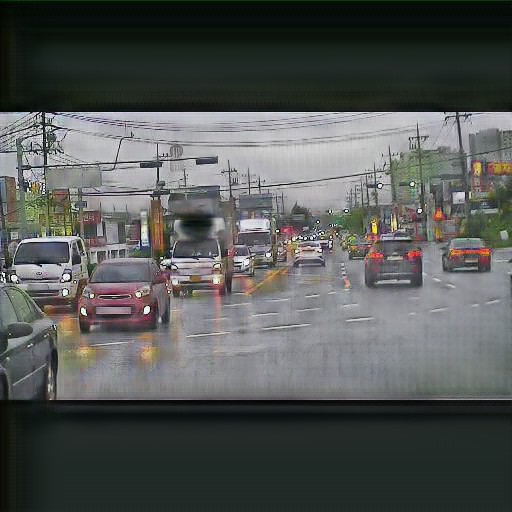

# CycleGAN을 활용한 날씨 변환 프로젝트

## 설명
- 이 프로젝트는 CycleGAN을 사용하여 맑은 날씨 이미지를 비 오는 날씨 이미지로 변환하는 모델을 학습합니다.
- 이 과정은 자율주행 차량의 다양한 날씨 조건 대응 능력을 강화하는데 활용됩니다.

---

## 데이터셋

> 데이터셋 용량이 커서 GitHub에 포함되지 않습니다.
대신, Google Drive에서 다운로드하여 로컬 환경에 설정해야합니다.

### 데이터 출처
- 데이터셋은 AIHUB의 **승용 자율주행차 악천후 데이터**를 가공하여 사용하였습니다.
- 자세한 정보는 [AIHUB 데이터셋 페이지](https://www.aihub.or.kr/aihubdata/data/view.do?currMenu=115&topMenu=100&aihubDataSe=data&dataSetSn=71626)를 참고하세요.

### 다운로드 및 설정 방법

1. [Google Drive 링크](https://drive.google.com/your_dataset_link)를 통해 데이터셋을 다운로드합니다.
2. 다운로드 후, 아래와 같은 디렉터리 구조로 데이터를 정리합니다

### 데이터셋 디렉터리 구조
데이터셋은 아래와 같은 구조로 정리되었습니다:

``` shell
./datasets/
├── testA # 맑은 날씨 이미지 (테스트용) 
├── testB # 비 오는 날씨 이미지 (테스트용) 
├── trainA # 맑은 날씨 이미지 (학습용) 
└── trainB # 비 오는 날씨 이미지 (학습용) 
```

### 데이터 구성
- **Train**:
  - 맑음: 4,400장
  - 비: 4,400장
  - 총합: 8,800장
- **Test**:
  - 맑음: 100장
  - 비: 100장
  - 총합: 100장


### 데이터 전처리
- 원본 이미지 크기: `1920×1080` -> `512x512`
- 도메인 A: 맑은 날씨 이미지
- 도메인 B: 비 오는 날씨 이미지


---

## 학습된 모델 다운로드
학습된 모델은 [Google Drive 링크](https://drive.google.com/drive/folders/1oPsO7psLeR8V-vOlpQTFKrb6WcKNSvM2?usp=drive_link)에서 다운로드할 수 있습니다. 다운로드 후, `checkpoints/` 폴더에 압축을 해제하세요.

## 학습 방법
CycleGAN 학습에 사용한 명령어는 다음과 같습니다:
```shell
python train.py \
  --dataroot ./datasets \
  --name weather \
  --model cycle_gan \
  --batch_size 1 \
  --load_size 512 \
  --crop_size 512
```

### 명령어 옵션 설명:
- --dataroot: 데이터셋 경로.
- --name: 학습 세션 이름 (결과가 저장될 디렉터리 이름).
- --model: CycleGAN 모델 사용.
- --batch_size: 배치 크기 (1장씩 학습).
- --load_size: 학습 전 이미지 크기 조정.
- --crop_size: 학습에 사용될 최종 이미지 크기.

---
## 결과물
- 학습 결과는 results/weather 디렉터리에 저장됩니다.
- 생성된 이미지는 두 가지 변환 결과를 포함합니다:
    - 맑은 날씨 → 비 오는 날씨
    - 비 오는 날씨 → 맑은 날씨

### 결과물 샘플
아래는 CycleGAN 학습 결과로 생성된 이미지 샘플입니다:

| 맑은 날씨 (원본) | 비 오는 날씨 (변환) |
|------------------|--------------------|
|  |  |
---

## 참고자료
- [CycleGAN 논문](https://arxiv.org/abs/1703.10593)
- [AIHUB 데이터셋 페이지](https://www.aihub.or.kr/aihubdata/data/view.do?currMenu=115&topMenu=100&aihubDataSe=data&dataSetSn=71626)
- [CycleGAN GitHub 코드베이스](https://github.com/junyanz/pytorch-CycleGAN-and-pix2pix)