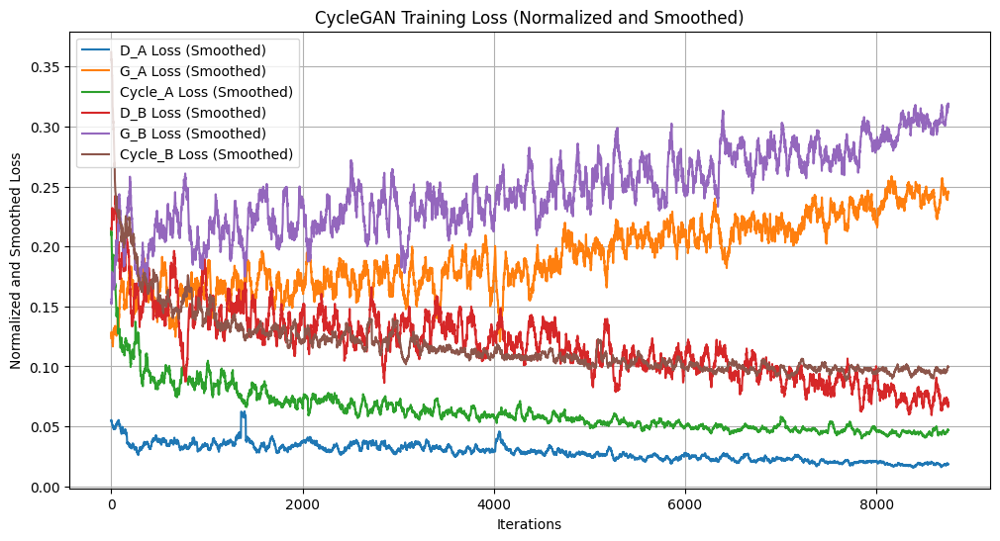
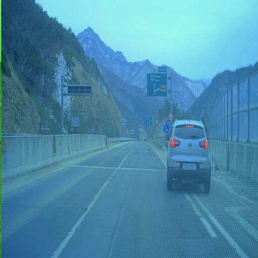
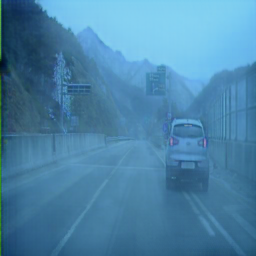
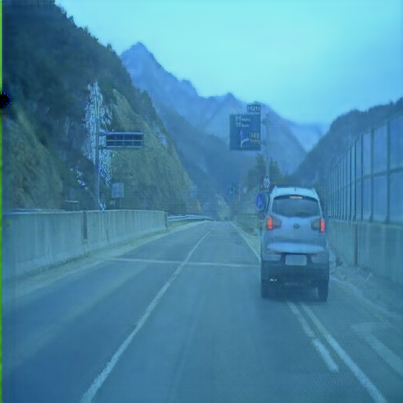
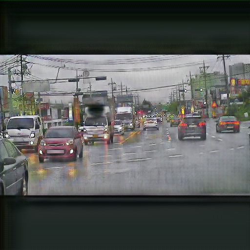

# CycleGAN 실험 결과 기록

## 실험 개요
- **실험 목적**: CycleGAN을 이용해 맑은 날씨 이미지를 비 오는 날씨 이미지로 변환.
- **데이터셋**: AIHub 자율주행차 악천후 데이터셋 ([링크](https://www.aihub.or.kr/aihubdata/data/view.do?dataSetSn=716))
  - TrainA: 맑은 날씨 이미지
  - TrainB: 비 오는 날씨 이미지

---

## 1차 실험 설정

### **하이퍼파라미터**
| 하이퍼파라미터        | 값              | 설명                                     |
|-----------------------|-----------------|------------------------------------------|
| `batch_size`          | 1               | 배치 크기                                |
| `load_size`           | 512             | 입력 이미지 크기 (조정 후)               |
| `crop_size`           | 512             | 입력 이미지 크기 (자른 후)               |
| `n_epochs`            | 100             | 초기 학습 에포크 수                      |
| `n_epochs_decay`      | 100             | 학습률 감소 단계 에포크 수              |
| `netG`                | resnet_9blocks  | 생성기 네트워크 구조 (ResNet-9 블록)    |
| `netD`                | basic           | 판별기 네트워크 구조                     |
| `lambda_identity`     | 0.5             | Identity 손실 가중치                     |
| `lambda_cycle`        | 10              | Cycle Consistency 손실 가중치            |
| `lr`                  | 0.0002          | 학습률                                   |
| `optimizer`           | Adam            | 최적화 알고리즘                          |

## 학습 결과
### **1. 손실 그래프**
아래는 학습 중 손실 값의 변화를 나타낸 그래프입니다.

#### **손실 그래프**
- **설명**: Discriminator, Generator, Cycle Consistency 손실의 변화를 나타냅니다.
- **결론**: 학습이 진행됨에 따라 손실 값이 수렴하는 경향을 확인할 수 있습니다.

#### **샘플 결과**
| 입력 이미지 (Real A) | 변환된 이미지 (Fake B) | 복원된 이미지 (Rec A) |
|-----------------------|------------------------|------------------------|
|  |  |  |

#### **비 오는 날씨로 변환**
| 입력 이미지 (Real A) | 변환된 이미지 (Fake B) |
|-----------------------|------------------------|
|  |  |

### **3. 학습 모델 성능 평가**
#### **평가 지표**
- **SSIM (Structural Similarity Index)**:
  - 맑은 날씨 → 비 오는 날씨 변환 시, 이미지 구조적 유사성을 평가.
  - **평균 SSIM**: 
- **PSNR (Peak Signal-to-Noise Ratio)**:
  - 변환 이미지의 픽셀 유사성을 평가.
  - **평균 PSNR**: 

---

## 실험 결과 분석
1. **Cycle Consistency 손실**:
   - 학습 중 Cycle Consistency 손실이 안정적으로 수렴.
   - A → B → A, B → A → B 변환 후 복구 성능이 향상됨.

2. **도메인 간 변환 품질**:
   - 맑은 날씨에서 비 오는 날씨로의 변환(`Real A → Fake B`)이 성공적으로 이루어짐.
   - 비 오는 날씨에서 맑은 날씨로의 변환(`Real B → Fake A`) 역시 자연스러움.

3. **한계점**:
   - 일부 복잡한 장면(예: 반사, 높은 채도 이미지)에서 변환 품질 저하.
   - 더 많은 데이터 증강과 하이퍼파라미터 조정 필요.

---
## 개선 및 추가 실험 계획
1. **하이퍼파라미터 튜닝**